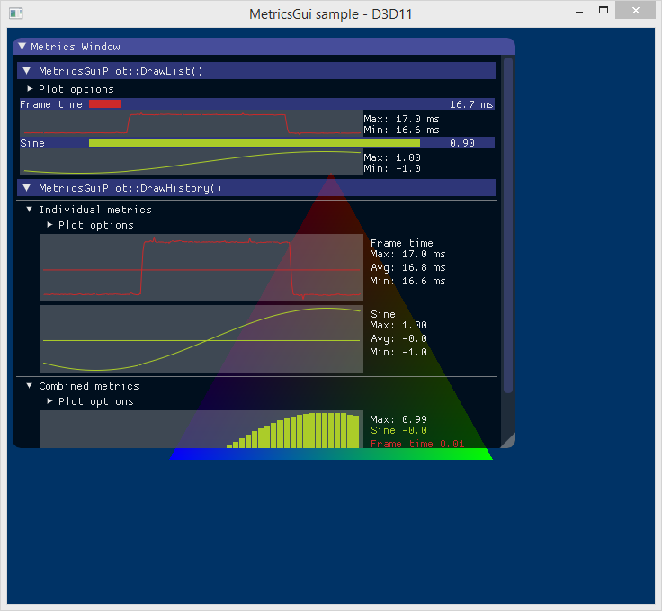
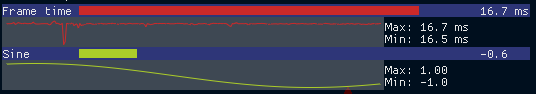
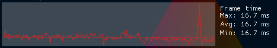

# MetricsGui

This library provides ImGui controls for displaying performance metrics such as the following:



## License

Copyright 2017 Intel Corporation

Permission is hereby granted, free of charge, to any person obtaining a copy of
this software and associated documentation files (the "Software"), to deal in
the Software without restriction, including without limitation the rights to
use, copy, modify, merge, publish, distribute, sublicense, and/or sell copies
of the Software, and to permit persons to whom the Software is furnished to do
so, subject to the following conditions:

The above copyright notice and this permission notice shall be included in all
copies or substantial portions of the Software.

THE SOFTWARE IS PROVIDED "AS IS", WITHOUT WARRANTY OF ANY KIND, EXPRESS OR
IMPLIED, INCLUDING BUT NOT LIMITED TO THE WARRANTIES OF MERCHANTABILITY,
FITNESS FOR A PARTICULAR PURPOSE AND NONINFRINGEMENT. IN NO EVENT SHALL THE
AUTHORS OR COPYRIGHT HOLDERS BE LIABLE FOR ANY CLAIM, DAMAGES OR OTHER
LIABILITY, WHETHER IN AN ACTION OF CONTRACT, TORT OR OTHERWISE, ARISING FROM,
OUT OF OR IN CONNECTION WITH THE SOFTWARE OR THE USE OR OTHER DEALINGS IN THE
SOFTWARE.

## Usage

A simple example of MetricsGui usage can be found in the sample app in the
'sample/' directory.

Essential steps include:

1. Allocate and initialize `MetricsGuiMetric` instances.

  ```C++
  // Note: MetricsGuiPlot does not assume ownership over added metrics, so it
  // is the users responsibility to manage the lifetime of MetricsGuiMetric
  // instances.
  MetricsGuiMetric frameTimeMetric("Frame time", "s", MetricsGuiMetric::USE_SI_UNIT_PREFIX);
  frameTimeMetric.mSelected = true;
  ```

2. Allocate and initialize `MetricsGuiPlot` instances.  The below shows all of the `MetricsGuiPlot` options with their default values (i.e., the same values set by the `MetricsGuiPlot` constructor) so you only need to set ones you want changed.

  ```C++
  MetricsGuiPlot frameTimePlot;
  frameTimePlot.mBarRounding        = 0.f;    // amount of rounding on bars
  frameTimePlot.mRangeDampening     = 0.95f;  // weight of historic range on axis range [0,1]
  frameTimePlot.mInlinePlotRowCount = 2;      // height of DrawList() inline plots, in text rows
  frameTimePlot.mPlotRowCount       = 5;      // height of DrawHistory() plots, in text rows
  frameTimePlot.mVBarMinWidth       = 6;      // min width of bar graph bar in pixels
  frameTimePlot.mVBarGapWidth       = 1;      // width of bar graph inter-bar gap in pixels
  frameTimePlot.mShowAverage        = false;  // draw horizontal line at series average
  frameTimePlot.mShowInlineGraphs   = false;  // show history plot in DrawList()
  frameTimePlot.mShowOnlyIfSelected = false;  // draw show selected metrics
  frameTimePlot.mShowLegendDesc     = true;   // show series description in legend
  frameTimePlot.mShowLegendColor    = true;   // use series color in legend
  frameTimePlot.mShowLegendUnits    = true;   // show units in legend values
  frameTimePlot.mShowLegendAverage  = false;  // show series average in legend
  frameTimePlot.mShowLegendMin      = true;   // show plot y-axis minimum in legend
  frameTimePlot.mShowLegendMax      = true;   // show plot y-axis maximum in legend
  frameTimePlot.mBarGraph           = false;  // use bars to draw history
  frameTimePlot.mStacked            = false;  // stack series when drawing history
  frameTimePlot.mSharedAxis         = false;  // use first series' axis range
  frameTimePlot.mFilterHistory      = true;   // allow single plot point to represent more than on history value
  ```

3. Add metrics to the plot.

  ```C++
  frameTimePlot.AddMetric(&frameTimeMetric);
  ```

4. Then, within your render loop you can add values to the metric history and update the plot axes.

  ```C++
  frameTimeMetric.AddNewValue(1.f / ImGui::GetIO().Framerate);
  frameTimePlot.UpdateAxes();
  ```

5. Render the GUI from within an ImGui window using either `MetricsGuiPlot::DrawList()` or `MetricsGuiPlot::DrawHistory()`.

  ```C++
  frameTimePlot.DrawList();
  ```

  

  ```C++
  frameTimePlot.DrawHistory();
  ```

  
